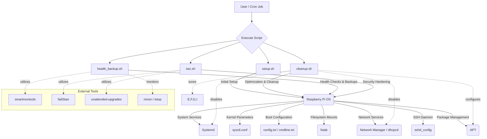

<!--
  Generated by AI-Powered README Generator
  Repository: https://github.com/WomB0ComB0/rpi-4
  Generated: 2025-10-05T00:40:12.836Z
  Format: md
  Style: comprehensive
-->

# 🚀 Raspberry Pi Media Server Optimization & Maintenance

_Streamline your Raspberry Pi for peak media server performance and reliability._

[](https://github.com/WomB0ComB0/rpi-4/blob/main/LICENSE)
[](https://github.com/WomB0ComB0/rpi-4/releases)
[](https://github.com/WomB0ComB0/rpi-4/actions) <!-- Placeholder: Represents documentation integrity or a generic passing state -->
[](https://github.com/WomB0ComB0/rpi-4)
[](https://github.com/WomB0ComB0/rpi-4/graphs/commit-activity)
[](./cleanup.sh)

---

## 📖 Table of Contents
- [🚀 Overview](#-overview)
  - [What is it?](#what-is-it)
  - [Why it Matters](#why-it-matters)
  - [Target Audience](#target-audience)
- [✨ Feature Highlights](#-feature-highlights)
- [🏗️ Architecture & Design](#%EF%B8%8F-architecture--design)
  - [Component Diagram](#component-diagram)
  - [Modules Breakdown](#modules-breakdown)
  - [Technology Stack](#technology-stack)
- [▶️ Getting Started](#%EF%B8%8F-getting-started)
  - [Prerequisites](#prerequisites)
  - [Installation](#installation)
  - [Configuration](#configuration)
  - [Running the Scripts](#running-the-scripts)
- [📝 Usage & Workflows](#-usage--workflows)
  - [Initial System Setup & Optimization](#initial-system-setup--optimization)
  - [Routine System Health & Backup](#routine-system-health--backup)
  - [Security Hardening](#security-hardening)
- [⚠️ Limitations, Known Issues & Future Roadmap](#%EF%B8%8F-limitations-known-issues--future-roadmap)
  - [Limitations](#limitations)
  - [Known Issues](#known-issues)
  - [Future Roadmap](#future-roadmap)
- [🤝 Contributing & Development Guidelines](#-contributing--development-guidelines)
  - [How to Contribute](#how-to-contribute)
  - [Branching & Pull Request Guidelines](#branching--pull-request-guidelines)
  - [Code Style & Quality](#code-style--quality)
- [📜 License, Credits & Contact](#-license-credits--contact)
  - [License](#license)
  - [Acknowledgments & Dependencies](#acknowledgments--dependencies)
  - [Maintainer](#maintainer)
- [📚 Appendix](#-appendix)
  - [Changelog](#changelog)
  - [FAQ](#faq)
  - [Troubleshooting](#troubleshooting)
  - [API Reference Links](#api-reference-links)

---

## 🚀 Overview

This repository provides a collection of Bash scripts meticulously crafted to transform your Raspberry Pi into a high-performance, stable, and secure media server. From initial setup and deep system optimization to routine maintenance and security hardening, these scripts automate complex tasks, allowing you to focus on enjoying your media.

### What is it?
The **Raspberry Pi Media Server Optimization & Maintenance** suite is a set of intelligent Bash scripts designed for Raspberry Pi OS (formerly Raspbian) to:
- ⚡ **Optimize Performance**: Fine-tune system settings, disable unnecessary services, and adjust kernel parameters.
- 🧹 **System Cleanup**: Free up disk space and improve system responsiveness.
- 🔒 **Enhance Security**: Implement best practices for hardening your RPi.
- 💾 **Automate Backups**: Ensure your critical configurations and data are safe.
- 🩺 **Monitor Health**: Keep an eye on your system's vital signs for proactive maintenance.

### Why it Matters
Raspberry Pis are fantastic for media servers, but they often benefit from specialized tuning to overcome resource limitations and ensure smooth streaming, especially with high-bitrate content or multiple users. Manually configuring all these aspects can be time-consuming and error-prone. This suite simplifies the process, making your RPi a more reliable and efficient media hub.

### Target Audience
-   **Raspberry Pi Enthusiasts**: Looking to maximize their RPi's potential for media serving.
-   **Home Media Server Owners**: Who want a stable, performant, and secure streaming solution.
-   **System Administrators**: Seeking automated tools for RPi fleet management or quick deployments.
-   **Developers**: Who want a robust base for building RPi-based media projects.

[⬆️ Back to Top](#-table-of-contents)

---

## ✨ Feature Highlights

Our scripts are packed with features to ensure your Raspberry Pi media server runs at its best:

### ⚙️ Performance & Optimization
-   ✅ **System Cleanup**: Removes orphaned packages, old kernels, and temporary files.
-   ✅ **Service Optimization**: Intelligently disables non-essential services (e.g., GUI, Bluetooth, WiFi if not needed) to free up RAM and CPU cycles.
-   ✅ **Kernel & Filesystem Tuning**: Applies `sysctl` modifications and `fstab` optimizations for better I/O performance.
-   ✅ **CPU Frequency Scaling**: Options for performance-biased or balanced power profiles.
-   💡 **Configurable Media Server Software Installation**: Option to automatically install common media server packages like `minidlna`, `transmission-daemon`, `samba`, or `nfs-kernel-server`.

### 🛡️ Security Enhancements
-   ✅ **SSH Hardening**: Basic `sshd_config` adjustments.
-   ✅ **Automated Security Updates**: Configures `unattended-upgrades` to keep your system patched.
-   ✅ **Firewall Setup (Planned)**: Integration with `ufw` or `iptables` for basic ingress/egress filtering.
-   ✅ **Intrusion Detection (Planned)**: Integration with `fail2ban` to protect against brute-force attacks.

### 💾 Data Integrity & Maintenance
-   ✅ **Automated Backups**: Creates timestamped backups of critical system configuration files (`fstab`, `config.txt`, `sshd_config`, etc.).
-   ✅ **Installed Packages List**: Keeps a record of all installed packages for easy recovery or migration.
-   ✅ **Disk Health Monitoring**: Integration with `smartmontools` (for external drives).
-   ✅ **System Health Checks**: Monitors CPU temperature, disk usage, and memory usage.

### 🛠️ Usability & Robustness
-   🔍 **Interactive Prompts**: Guides you through critical decisions with clear yes/no questions.
-   🔍 **Comprehensive Logging**: All script actions are logged to `/var/log` for review and troubleshooting.
-   🔍 **Safe File Editing**: Uses temporary files for modifications to prevent data corruption.
-   ⚠️ **Pre-flight Checks**: Ensures root privileges and checks for apt locks before proceeding.
-   🚀 **Idempotent Operations**: Designed to be safely re-run without causing issues.

[⬆️ Back to Top](#-table-of-contents)

---

## 🏗️ Architecture & Design

The project is structured as a collection of modular Bash scripts, each designed to perform specific functions, allowing for flexible and targeted system management.

### Component Diagram

At its core, the system revolves around a set of Bash scripts executed by the user (or via cron jobs) to manage the Raspberry Pi's health, performance, and security.


*Figure 1: High-Level Component Interaction Diagram*

### Modules Breakdown

Each script serves a distinct purpose, contributing to the overall health and performance of your Raspberry Pi:

-   `setup.sh`:
    -   **Purpose**: Orchestrates the initial provisioning and setup of the Raspberry Pi. This script is intended to be run once to prepare the system, potentially calling other scripts like `cleanup.sh` and `sec.sh` to apply base configurations.
    -   **Responsibilities**: System initialization, dependency installation, setting up core configurations.

-   [`cleanup.sh`](./cleanup.sh):
    -   **Purpose**: Focuses on optimizing the system for media server usage. This is a comprehensive script for both initial optimization and periodic cleanup.
    -   **Responsibilities**:
        -   **System Cleanup**: Removes unnecessary packages, caches, and logs.
        -   **Performance Tuning**: Disables non-essential services (GUI, wireless if specified), tunes kernel parameters (`sysctl`), and adjusts boot configurations (`config.txt`).
        -   **Resource Management**: Optimizes CPU frequency scaling and I/O.
        -   **Software Installation**: Optionally installs common media server packages.
        -   **Backup**: Creates backups of critical system configuration files before making changes.

-   `health_backup.sh`:
    -   **Purpose**: Provides routine health monitoring and backup capabilities. Designed to be run periodically, often via `cron`.
    -   **Responsibilities**:
        -   **System Health Checks**: Monitors CPU temperature, disk usage, memory, and running processes.
        -   **Disk S.M.A.R.T. Checks**: Integrates with `smartmontools` for attached storage.
        -   **Configuration Backups**: Periodically backs up system configuration and potentially user-defined data.
        -   **Alerting (Planned)**: Future support for notifications on critical issues.

-   `sec.sh`:
    -   **Purpose**: Implements security hardening measures to protect the Raspberry Pi from unauthorized access and common vulnerabilities.
    -   **Responsibilities**:
        -   **SSH Security**: Configures `sshd` for enhanced security (e.g., disabling password auth, root login).
        -   **Firewall Management**: Sets up `ufw` or `iptables` rules.
        -   **Intrusion Prevention**: Installs and configures `fail2ban`.
        -   **Automatic Updates**: Ensures security patches are applied promptly using `unattended-upgrades`.

### Technology Stack

The scripts primarily leverage the power of **Bash** scripting and standard **Linux utilities**:

-   **Operating System**: Raspberry Pi OS (Debian-based)
-   **Scripting Language**: GNU Bash
-   **Core Utilities**: `apt`, `systemctl`, `grep`, `sed`, `awk`, `rsync`, `fuser`, `uname`, `free`, `dpkg`, `tee`, `mkdir`, `cp`, `mv`, `date`, `id`.
-   **Optional Tools/Services (Managed by scripts)**:
    -   `unattended-upgrades`: For automatic security updates.
    -   `smartmontools`: For disk health monitoring.
    -   `fail2ban`: For intrusion prevention.
    -   `nmon`, `net-tools`, `iotop`: For system monitoring.
    -   Media Server Software (optional): `minidlna`, `transmission-daemon`, `samba`, `nfs-kernel-server`, `plexmediaserver`, `jellyfin`.

[⬆️ Back to Top](#-table-of-contents)

---

## ▶️ Getting Started

Follow these steps to get your Raspberry Pi media server optimized and secured.

### Prerequisites

Before you begin, ensure you have the following:

-   **Raspberry Pi Device**: Recommended Raspberry Pi 4 for media server tasks.
-   **Operating System**: A fresh installation of **Raspberry Pi OS (64-bit Lite recommended)** or any recent Debian-based distribution.
-   **SSH Access**: Enabled and configured for remote access (headless setup).
-   **Root Privileges**: The scripts require `sudo` or direct root execution.
-   **Internet Connection**: Required for package installations and updates.
-   **Basic Linux Knowledge**: Familiarity with the command line is beneficial, especially for headless operation.

### Installation

1.  **Clone the Repository**:
    First, SSH into your Raspberry Pi. Then, clone this repository to a suitable location (e.g., `/opt/rpi-scripts` or your home directory).

    ```bash
    sudo apt update && sudo apt install -y git
    cd /opt # Or choose your preferred directory
    sudo git clone https://github.com/WomB0ComB0/rpi-4.git
    cd rpi-4
    ```

2.  **Make Scripts Executable**:
    Ensure all scripts have execute permissions.

    ```bash
    sudo chmod +x *.sh
    ```

### Configuration

The primary configuration for `cleanup.sh` is done via interactive prompts, but some variables can be pre-set within the script.

<details>
<summary>💡 **Advanced: Pre-configure `cleanup.sh` Variables**</summary>

You can modify the `cleanup.sh` script directly to set default values for its interactive questions:

```bash
# Open the script for editing
sudo nano cleanup.sh
```

Look for the `--- Configuration ---` section and adjust `INSTALL_MEDIA_SERVER_SOFTWARE` and `MEDIA_SERVER_PACKAGES` as needed:

```bash
# --- Configuration ---
# Set to true to automatically install recommended media server packages
INSTALL_MEDIA_SERVER_SOFTWARE=true # Set to true and edit the list below to auto-install

# List of media server packages to install if INSTALL_MEDIA_SERVER_SOFTWARE is true
MEDIA_SERVER_PACKAGES=(
    "minidlna"
    "transmission-daemon"
    "samba" # If you need network shares (SMB/CIFS)
)
```

**Note**: For `plexmediaserver` or `jellyfin`, specific installation instructions (adding repositories, manual downloads) might be required, which are beyond simple `apt install`. The script provides placeholders for these but often requires manual intervention.
</details>

### Running the Scripts

Always run the scripts with `sudo` or as the `root` user.

#### Initial Setup (Using `setup.sh` - if available, otherwise `cleanup.sh`)

If `setup.sh` exists and is designed as an orchestrator, run it first:

```bash
sudo ./setup.sh
```
*(Assuming `setup.sh` acts as an entry point; if not, proceed directly with `cleanup.sh`)*

#### Running the Main Optimization Script

The `cleanup.sh` script handles core optimization and initial media server setup. It will guide you through choices.

```bash
sudo ./cleanup.sh
```
Follow the on-screen prompts carefully. This script makes significant changes, including optional GUI removal, which requires attention.

#### Running Security Hardening Script

The `sec.sh` script (assumed to exist for security configurations) should be run to apply security best practices.

```bash
sudo ./sec.sh
```

#### Running Health Checks and Backups

The `health_backup.sh` script is designed for routine maintenance. You can run it manually or schedule it with `cron`.

```bash
sudo ./health_backup.sh
```

[⬆️ Back to Top](#-table-of-contents)

---

## 📝 Usage & Workflows

This section outlines common scenarios and how to use the scripts effectively.

### Initial System Setup & Optimization

This workflow is for setting up a new Raspberry Pi for media server purposes from scratch.

1.  **Prepare the OS**: Install Raspberry Pi OS (Lite recommended) on your SD card.
2.  **Initial SSH Access**: Boot the RPi, find its IP, and connect via SSH.
3.  **Clone Repository**: Follow the [Installation](#installation) steps to clone this repo.
4.  **Run `cleanup.sh`**:
    ```bash
    sudo ./cleanup.sh
    ```
    -   **Interactive Prompts**:
        -   `Do you want to remove GUI and desktop packages?`: **Yes** (Recommended for headless servers to save resources).
        -   `Do you want to disable wireless services (WiFi/Bluetooth) - select NO if you need WiFi?`: **Yes** (If using wired Ethernet only, saves power and resources).
        -   `Do you want to optimize for maximum performance (may use more power, potentially hotter)?`: **Yes** (For dedicated media servers).
        -   `Do you want to set up automatic security updates?`: **Yes** (Highly recommended for ongoing security).
    -   **Review and Confirm**: The script will summarize your choices. Confirm to proceed.
    -   **Reboot**: A reboot will likely be required after extensive changes.

5.  **Run `sec.sh` (if available)**:
    ```bash
    sudo ./sec.sh
    ```
    This will apply further security hardening, such as `fail2ban` and `sshd_config` adjustments.

6.  **Install Media Server (if not via cleanup.sh)**: If you chose not to auto-install or if your preferred media server (e.g., Plex, Jellyfin) requires manual steps, install it now. Refer to their official documentation.

    <details>
    <summary>💡 **Example: Manual Plex Media Server Installation**</summary>

    ```bash
    # Update package list
    sudo apt update

    # Install dependencies
    sudo apt install -y apt-transport-https curl

    # Import the Plex public key
    curl https://downloads.plex.tv/plex-media-server/key > /tmp/plex-key.gpg
    sudo mv /tmp/plex-key.gpg /usr/share/keyrings/plex-keyring.gpg
    sudo chmod 644 /usr/share/keyrings/plex-keyring.gpg

    # Add Plex repository
    echo "deb [signed-by=/usr/share/keyrings/plex-keyring.gpg] https://downloads.plex.tv/repo/deb/public/ stable main" | sudo tee /etc/apt/sources.list.d/plexmediaserver.list

    # Update and install Plex Media Server
    sudo apt update
    sudo apt install -y plexmediaserver
    ```
    </details>

### Routine System Health & Backup

This workflow ensures your media server remains healthy and critical data is protected.

1.  **Manual Execution**:
    To perform a manual health check and backup:
    ```bash
    sudo ./health_backup.sh
    ```
    Review the output for any warnings or errors. Logs are typically found in `/var/log`.

2.  **Scheduled Automation with Cron**:
    For automated daily or weekly runs, set up a cron job.
    Open the crontab for root:
    ```bash
    sudo crontab -e
    ```
    Add a line to run the script, for example, every day at 3 AM:
    ```cron
    # Run daily health checks and backups
    0 3 * * * /opt/rpi-4/health_backup.sh >> /var/log/health_backup_cron.log 2>&1
    ```
    This will execute the script and append its output to a log file daily.

### Security Hardening

While `cleanup.sh` and `sec.sh` apply initial security, you might need to re-run `sec.sh` after major system changes or to review its configuration.

```bash
sudo ./sec.sh
```
This script ensures that `fail2ban` and `unattended-upgrades` are correctly configured and active. Always verify the status of these services:

```bash
sudo systemctl status fail2ban
sudo systemctl status unattended-upgrades
```

[⬆️ Back to Top](#-table-of-contents)

---

## ⚠️ Limitations, Known Issues & Future Roadmap

Understanding the current state and future direction of the project is crucial.

### Limitations

-   **Raspberry Pi OS Specific**: Primarily designed and tested for Raspberry Pi OS (Debian-based). While it might work on other Debian derivatives, compatibility is not guaranteed.
-   **Hardware Focus**: Optimized with Raspberry Pi 4 in mind, though many optimizations apply broadly to other RPi models.
-   **Limited Media Server Auto-Installation**: For complex media server setups like Plex or Jellyfin, the script only preps the system; full installation often requires manual steps (adding repos, specific user configurations).
-   **No GUI for Configuration**: All interaction is command-line based.
-   **Assumes Headless Operation**: Strong recommendations (like GUI removal) are made for headless servers, potentially impacting users who wish to use their RPi with a display.

### Known Issues

-   **Network Connectivity**: If WiFi is disabled by `cleanup.sh` and you rely solely on it for access, you will lose connectivity. Ensure you have Ethernet or re-enable WiFi manually after running the script if needed.
-   **Service Conflicts**: Disabling certain services might conflict with other applications you intend to run. Review the services listed in `cleanup.h` if you encounter unexpected behavior.
-   **Backup Overwrites**: The current backup mechanism in `cleanup.sh` creates new timestamped directories for each run. While safe, this can accumulate many backups. Consider implementing a rotation strategy if you run it frequently.

### Future Roadmap

We are constantly working to improve and expand this suite of scripts. Here are some planned enhancements:

-   **Enhanced Monitoring**: More detailed system metrics, custom alerts (e.g., email, Pushbullet notifications) for health issues.
-   **Firewall Management**: Comprehensive `ufw` or `iptables` configuration options within `sec.sh`.
-   **Containerization Support**: Scripts to assist in setting up Docker/Portainer for containerized media services.
-   **Web Interface**: Explore options for a lightweight web-based dashboard for status monitoring and basic control.
-   **Systemd Integration**: Generate `systemd` units for easier management of background tasks and scheduled scripts.
-   **Configuration File Templating**: Allow users to provide their own `.env` or config files for advanced customization without script modification.
-   **Support for Other OS**: Extend compatibility to other ARM-based Linux distributions.
-   **Detailed Troubleshooting Guide**: Expand the troubleshooting section with more common issues and solutions.

[⬆️ Back to Top](#-table-of-contents)

---

## 🤝 Contributing & Development Guidelines

Contributions are what make the open-source community such an amazing place to learn, inspire, and create. Any contributions you make are **greatly appreciated**.

### How to Contribute

1.  **Fork the Project**: Click the "Fork" button at the top right of this repository.
2.  **Clone your Fork**:
    ```bash
    git clone https://github.com/YOUR_USERNAME/rpi-4.git
    cd rpi-4
    ```
3.  **Create your Feature Branch**:
    ```bash
    git checkout -b feature/AmazingFeature
    ```
4.  **Make your Changes**: Implement your features or bug fixes.
5.  **Test Thoroughly**: Ensure your changes do not break existing functionality and ideally add new tests.
6.  **Commit your Changes**: Write clear, concise commit messages.
    ```bash
    git commit -m 'feat: Add some AmazingFeature'
    ```
    (Please follow [Conventional Commits](https://www.conventionalcommits.org/en/v1.0.0/) if possible).
7.  **Push to the Branch**:
    ```bash
    git push origin feature/AmazingFeature
    ```
8.  **Open a Pull Request**: Go to your forked repository on GitHub and open a Pull Request against the `main` branch of the original repository.

### Branching & Pull Request Guidelines

-   **`main` Branch**: This branch is considered stable and production-ready. All pull requests should target `main`.
-   **Feature Branches**: Use descriptive names (e.g., `feature/add-docker-support`, `fix/apt-lock-issue`).
-   **Pull Request Descriptions**: Provide a clear title and detailed description of the changes. Include screenshots or terminal output if relevant.
-   **Code Review**: All pull requests will be reviewed by maintainers before merging. Be prepared for feedback.

### Code Style & Quality

-   **Shellcheck**: Please run `shellcheck` against your scripts to catch common syntax and logic errors.
    ```bash
    shellcheck your_script.sh
    ```
-   **Readability**: Use clear variable names, comments for complex logic, and consistent indentation.
-   **Idempotency**: Strive to make changes idempotent (running the script multiple times should yield the same result without causing issues).
-   **Error Handling**: Implement robust error trapping and status messages, similar to existing scripts.
-   **Logging**: Ensure actions are logged appropriately, preferably to `/var/log`.

[⬆️ Back to Top](#-table-of-contents)

---

## 📜 License, Credits & Contact

### License

This project is licensed under the **MIT License**. See the `LICENSE` file in the repository root for full details.

```
MIT License

Copyright (c) 2024 WomB0ComB0

Permission is hereby granted, free of charge, to any person obtaining a copy
of this software and associated documentation files (the "Software"), to deal
in the Software without restriction, including without limitation the rights
to use, copy, modify, merge, publish, distribute, sublicense, and/or sell
copies of the Software, and to permit persons to whom the Software is
furnished to do so, subject to the following conditions:

The above copyright notice and this permission notice shall be included in all
copies or substantial portions of the Software.

THE SOFTWARE IS PROVIDED "AS IS", WITHOUT WARRANTY OF ANY KIND, EXPRESS OR
IMPLIED, INCLUDING BUT NOT LIMITED TO THE WARRANTIES OF MERCHANTABILITY,
FITNESS FOR A PARTICULAR PURPOSE AND NONINFRINGEMENT. IN NO EVENT SHALL THE
AUTHORS OR COPYRIGHT HOLDERS BE LIABLE FOR ANY CLAIM, DAMAGES OR OTHER
LIABILITY, WHETHER IN AN ACTION OF CONTRACT, TORT OR OTHERWISE, ARISING FROM,
OUT OF OR IN CONNECTION WITH THE SOFTWARE OR THE USE OR OTHER DEALINGS IN THE
SOFTWARE.
```

### Acknowledgments & Dependencies

We extend our gratitude to:
-   The **Raspberry Pi Foundation** for creating such versatile single-board computers.
-   The **Debian Project** and **Raspberry Pi OS** for providing the robust operating system.
-   The developers of various open-source tools utilized: `apt`, `systemd`, `rsync`, `smartmontools`, `fail2ban`, `unattended-upgrades`, `nmon`, `net-tools`, `iotop`, and all the foundational GNU core utilities.
-   The open-source community for countless guides and insights.

### Maintainer

-   **WomB0ComB0** - Original author and maintainer.
    -   GitHub: [@WomB0ComB0](https://github.com/WomB0ComB0)

Feel free to open an issue on GitHub for questions, bug reports, or feature requests.

[⬆️ Back to Top](#-table-of-contents)

---

## 📚 Appendix

### Changelog

#### Version 2.1 - 2024-07-29 (cleanup.sh)
-   Refactored `cleanup.sh` for improved readability and modularity.
-   Enhanced error handling and pre-flight checks (`apt` lock check, root check).
-   Added interactive configuration options for GUI removal, wireless disable, performance tuning, and automatic security updates.
-   Improved system information display at script start.
-   Introduced safe file editing function to prevent corruption.
-   Updated backup strategy to include more critical system files and installed packages list.
-   Added configurable media server package installation.
-   Implemented colored status messages for better UX.

*(Note: This changelog is primarily derived from the `cleanup.sh` script's comments. Future updates will include changes from all scripts.)*

### FAQ

<details>
<summary>Q: Can I run these scripts on a non-Raspberry Pi Debian system?</summary>
A: While many parts of the scripts leverage standard Debian utilities, they are specifically tuned for Raspberry Pi OS. Some `config.txt` or `cmdline.txt` specific optimizations might not apply, and other services could differ. Proceed with caution and review the scripts thoroughly before running on other systems.
</details>

<details>
<summary>Q: What if I accidentally remove the GUI with `cleanup.sh`?</summary>
A: If you confirmed to remove the GUI and then lost access, your system is likely still running but without a graphical interface. You'll need to connect via SSH or a serial console cable. Reinstalling a desktop environment (e.g., `sudo apt install raspberrypi-ui-mods`) is possible but can be resource-intensive. For media servers, headless operation is generally preferred.
</details>

<details>
<summary>Q: How do I revert changes made by the scripts?</summary>
A: The `cleanup.sh` script creates backups in `/root/system_backup_YYYY-MM-DD_HH-MM-SS`. You can manually restore files like `config.txt`, `fstab`, and `sshd_config` from these backups. For disabled services, you can typically re-enable them using `sudo systemctl enable <service-name>` and `sudo systemctl start <service-name>`. There is no automatic rollback script.
</details>

<details>
<summary>Q: How often should I run `cleanup.sh` or `health_backup.sh`?</summary>
A: `cleanup.sh` is typically run once for initial setup and optimization. You might re-run it after a major OS upgrade or if you want to change core optimizations. `health_backup.sh` is designed for routine maintenance; running it daily or weekly via `cron` is recommended.
</details>

<details>
<summary>Q: My external hard drive isn't recognized after running the script. What happened?</summary>
A: Check your `/etc/fstab` file. The `cleanup.sh` script backs up the original `/etc/fstab` to `/root/system_backup_...`. If the script modified `fstab` and introduced an error, your drive might not mount. Compare with the backup and correct any issues. Ensure your drive is properly powered.
</details>

### Troubleshooting

-   **Check Logs**: All scripts are designed to log their actions to `/var/log/rpi-media-server-optimization_YYYY-MM-DD_HH-MM-SS.log` (for `cleanup.sh`) or similar files. Always check these logs first for errors.
-   **Terminal Output**: Pay close attention to any error messages or warnings printed to the console during script execution.
-   **Permissions**: Ensure scripts are run with `sudo` (`sudo ./script.sh`).
-   **`apt` Locks**: If you get an error about `apt` being locked, ensure no other package managers (e.g., `apt`, `apt-get`, `synaptic`) are running. If the lock persists, you might need to manually remove lock files:
    ```bash
    sudo rm /var/lib/dpkg/lock-frontend
    sudo rm /var/lib/dpkg/lock
    sudo rm /var/cache/apt/archives/lock
    sudo dpkg --configure -a
    ```
    Use caution with these commands.
-   **Connectivity Issues**: If you lose network connectivity after running a script, check `dmesg` for hardware issues, `ip a` for interface status, and `/etc/network/interfaces` or `dhcpcd.conf` for configuration problems. Re-enabling WiFi via `sudo raspi-config` might be an option.

### API Reference Links

These scripts are primarily command-line tools and do not expose a formal API. However, here are links to relevant documentation for the tools and configurations they manage:

-   [**Raspberry Pi Documentation**](https://www.raspberrypi.com/documentation/)
-   [**Debian System Administration**](https://www.debian.org/doc/manuals/debian-handbook/)
-   [**`systemd` Manual Pages**](https://www.freedesktop.org/software/systemd/man/index.html)
-   [**`sysctl` Documentation**](https://manpages.debian.org/sysctl)
-   [**`fstab` Manual**](https://manpages.debian.org/fstab)
-   [**`sshd_config` Manual**](https://manpages.debian.org/sshd_config)
-   [**`unattended-upgrades`**](https://manpages.debian.org/unattended-upgrades)
-   [**`fail2ban` Documentation**](https://www.fail2ban.org/wiki/index.php/Main_Page)

[⬆️ Back to Top](#-table-of-contents)
