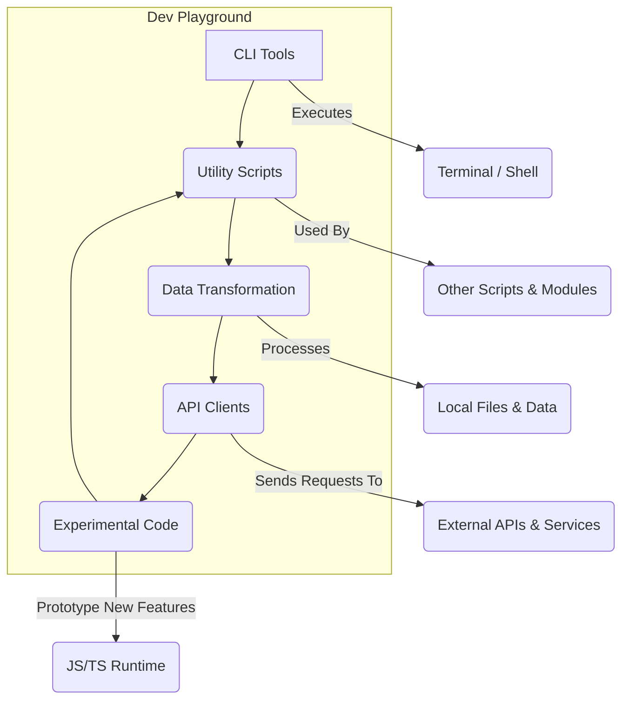

<!--
  Generated by AI-Powered README Generator
  Repository: https://github.com/WomB0ComB0/js-testing
  Generated: 2025-10-05T01:47:41.223Z
  Format: md
  Style: comprehensive
-->

# 🚀 JS/TS Dev Playground: Utilities, Snippets & Experiments

_A versatile collection of JavaScript and TypeScript utilities, experimental scripts, and API integration examples._

[](https://github.com/WomB0ComB0/js-testing/blob/main/LICENSE)
[](https://github.com/WomB0ComB0/js-testing)
[](./package.json)
[](https://www.typescriptlang.org/)
[](https://github.com/WomB0ComB0/js-testing/actions) <!-- Placeholder: Assumes a CI/CD pipeline for linting/type-checking -->

---

## 📖 Table of Contents

-   [🚀 Overview](#-overview)
    -   [What is the JS/TS Dev Playground?](#what-is-the-jsts-dev-playground)
    -   [Why it Matters](#why-it-matters)
    -   [Target Audience](#target-audience)
-   [✨ Feature Highlights](#-feature-highlights)
    -   [🔌 API Integrations](#-api-integrations)
    -   [🛠️ Utility & Transformation Functions](#%EF%B8%8F-utility--transformation-functions)
    -   [🔬 Experimental & Learning Code](#-experimental--learning-code)
    -   [🚀 CLI Tools & Automation](#-cli-tools--automation)
-   [🏗️ Architecture & Design](#%EF%B8%8F-architecture--design)
    -   [Modular Structure](#modular-structure)
    -   [Component Diagram](#component-diagram)
    -   [Technology Stack](#technology-stack)
-   [▶️ Getting Started](#%EF%B8%8F-getting-started)
    -   [Prerequisites](#prerequisites)
    -   [Installation](#installation)
    -   [Configuration](#configuration)
    -   [Running Scripts](#running-scripts)
-   [📝 Usage & Workflows](#-usage--workflows)
    -   [Executing a Utility Script](#executing-a-utility-script)
    -   [Using an API Integration Script](#using-an-api-integration-script)
    -   [Running a CLI Tool](#running-a-cli-tool)
    -   [Exploring Design Patterns](#exploring-design-patterns)
-   [⁉️ Limitations, Known Issues & Future Roadmap](#%EF%B8%8F-limitations-known-issues--future-roadmap)
    -   [Limitations](#limitations)
    -   [Known Issues](#known-issues)
    -   [Future Roadmap](#future-roadmap)
-   [🤝 Contributing & Development Guidelines](#-contributing--development-guidelines)
    -   [How to Contribute](#how-to-contribute)
    -   [Branching & Pull Request Guidelines](#branching--pull-request-guidelines)
    -   [Code Style, Linting & Testing](#code-style-linting--testing)
    -   [Development Setup](#development-setup)
-   [📜 License, Credits & Contact](#-license-credits--contact)
    -   [License](#license)
    -   [Acknowledgments & Dependencies](#acknowledgments--dependencies)
    -   [Maintainer](#maintainer)
-   [📚 Appendix](#-appendix)
    -   [Changelog](#changelog)
    -   [FAQ](#faq)
    -   [Troubleshooting Guide](#troubleshooting-guide)
    -   [External API References](#external-api-references)

---

## 🚀 Overview

This repository, `js-testing`, serves as a dynamic sandbox for experimenting with various JavaScript and TypeScript concepts, integrating with external APIs, and developing practical utilities and CLI tools. It's a living collection of code snippets, prototypes, and small projects, constantly evolving with new ideas and explorations.

### What is the JS/TS Dev Playground?

The **JS/TS Dev Playground** is not a single, cohesive application, but rather a curated collection of independent scripts and modules. Its primary purpose is to:

*   **Accelerate Prototyping**: Quickly test ideas, algorithms, and API integrations.
*   **Showcase Code Snippets**: Provide readily available, runnable examples for common (and uncommon) programming tasks.
*   **Explore New Technologies**: Experiment with emerging JavaScript/TypeScript libraries, frameworks, and language features.
*   **Facilitate Learning**: Serve as a personal knowledge base for design patterns, data structures, and best practices.
*   **Develop Small Tools**: Create lightweight CLI tools and utilities for everyday development needs.

### Why it Matters

In the fast-paced world of web development, having a personal toolkit for rapid experimentation and problem-solving is invaluable. This repository addresses the need for:

*   **Quick Solutions**: Instead of starting from scratch, find a relevant script, adapt it, and solve the problem.
*   **Learning by Doing**: Understand concepts by seeing them implemented in practical (though often simplified) contexts.
*   **Reduced Friction**: Lower the barrier to trying out new APIs or libraries.
*   **Code Reusability**: Prevent reinventing the wheel for common tasks across different projects.

### Target Audience

*   **JavaScript & TypeScript Developers**: Looking for examples, utilities, or a quick way to test concepts.
*   **Learners & Students**: Exploring modern JS/TS features, design patterns, and API interactions.
*   **Backend & Frontend Engineers**: Needing snippets for data manipulation, API calls, or small automation tasks.
*   **Anyone curious about experimental programming paradigms** within the JS/TS ecosystem.

[⬆️ Back to Top](#-table-of-contents)

---

## ✨ Feature Highlights

This repository is a diverse collection, offering a wide array of functionalities categorized for easier navigation:

### 🔌 API Integrations
Get up and running quickly with various external services.
-   ✅ **News & Article APIs**: Scripts for fetching data from `gnews-api.ts`, `news-api.ts`, `article-api.ts`.
-   ✅ **Media & Entertainment**: Interact with `spotify-genre-search.ts`, `twitch-alert.ts`.
-   ✅ **AI & ML**: Explore `gemini-models.ts`, `image-gemini-pipeline.ts`, `project-llm.ts`, `google-cloud-vision.ts`.
-   ✅ **Web Scraping & Data Extraction**: `fire-crawl-cli.ts`, `fire-crawl-parser.ts`, `linkedin-profile-parser.ts`, `webshot.ts`, `iframe-remover.ts`.
-   💡 **E-commerce**: `food-api.ts`, `shopping-api.ts`, `product-decoder-pipeline.ts`.
-   ⚠️ **Authentication**: Most API scripts assume API keys are provided via environment variables, not hardcoded.

### 🛠️ Utility & Transformation Functions
Everyday helpers for common development tasks.
-   ✅ **Text & Markdown Processing**: `markdown-to-text.ts`, `markdown-to-google-docs.ts`, `unified-formatter.ts`, `linkedin-title-cleaner.ts`.
-   ✅ **File & Directory Management**: `files.ts`, `format-gitignore.ts`.
-   ✅ **Data Structures & Algorithms**: `distance-formulas.ts`, `lazy-map.ts`, `map.ts`, `sort.ts`, `vector.ts`.
-   ✅ **Type & Error Handling**: `error-predicate.ts`.
-   💡 **CSS/SCSS Transformation**: Convert CSS syntax to SCSS with `css-to-scss.ts`.
-   🔍 **Logging & Debugging**: Simple `logger.ts` implementation.

### 🔬 Experimental & Learning Code
Dive into advanced concepts and new language features.
-   ✅ **Design Patterns**: Examples of various design patterns in TypeScript (`ts-design-patterns.ts`).
-   ✅ **Effect-TS**: Experimentation with the `Effect` library (`effect-fetch.ts`).
-   ✅ **Bun Runtime Specifics**: Explore `bun-shell-case.ts` for Bun's shell capabilities.
-   ✅ **Web Frameworks**: Starter/Advanced examples for `ElysiaJS` (`elysia-starter-advanced.ts`).
-   ✅ **Database Interactions**: Examples for `mongo.ts`, `mongoose.ts`, `xls-to-firestore-advanced.ts`.
-   🚀 **Performance Testing**: `performance.ts` for benchmarking code.
-   💡 **Advanced Pipelines**: `image-gemini-pipeline.ts`, `product-decoder-pipeline.ts` demonstrate complex data flows.

### 🚀 CLI Tools & Automation
Small but mighty tools for developer workflows.
-   ✅ **README Generator**: `greadme.ts` (perhaps this very README was inspired by it!).
-   ✅ **Topic Generator**: `gtopic.ts` for generating discussion topics.
-   ✅ **File Documentation**: `file-doc-gen.ts` to automate basic documentation.
-   ✅ **Terminal Git Helpers**: `terminal-git.ts` for custom Git commands.
-   ⚠️ **Platform Specific**: Some CLI tools might rely on specific shell environments or installed tools.

[⬆️ Back to Top](#-table-of-contents)

---

## 🏗️ Architecture & Design

This repository is designed as a *modular toolkit* rather than a monolithic application. Each `.ts` or `.js` file typically represents an independent script, module, or a small self-contained project. This design promotes reusability, isolation, and ease of experimentation.

### Modular Structure

The directory structure is flat, with each file serving a distinct purpose. While there aren't formal "modules" in the sense of a large application, related functionalities can be grouped logically by their filename prefixes or inferred categories.

*   **API Clients**: Files like `gnews-api.ts`, `spotify-genre-search.ts`, `gemini-models.ts` encapsulate logic for interacting with specific external APIs.
*   **Utilities**: Scripts such as `markdown-to-text.ts`, `distance-formulas.ts`, `format-gitignore.ts` provide general-purpose helper functions.
*   **CLI Tools**: Executable scripts like `greadme.ts`, `file-doc-gen.ts` are designed to be run directly from the command line.
*   **Experimental/Prototypes**: Files prefixed with `test-`, or containing new library explorations (e.g., `effect-fetch.ts`, `elysia-starter-advanced.ts`) are for learning and proof-of-concept.
*   **Design Patterns**: `ts-design-patterns.ts` demonstrates architectural approaches.

### Component Diagram

The following Mermaid diagram illustrates the conceptual architecture, showing how various categories of scripts interact with external services and system components.



*   **CLI Tools**: User-facing scripts that provide command-line interfaces for specific tasks.
*   **Utility Scripts**: Reusable functions and logic that can be imported or executed independently.
*   **Data Transformation**: Scripts focused on manipulating and converting data formats.
*   **API Clients**: Modules designed to communicate with third-party web services.
*   **Experimental Code**: A sandbox for testing new libraries, language features, or complex pipelines without affecting other parts.
*   **External APIs & Services**: Represents the various web services (e.g., Google Gemini, GNews, Spotify) that the API clients interact with.
*   **Local Files & Data**: Where scripts read from or write to, including configuration files, input data, or generated output.
*   **JS/TS Runtime**: The execution environment (Node.js, Bun) where all scripts operate.

### Technology Stack

This repository primarily leverages the following technologies:

*   **Languages**:
    *   **TypeScript**: The majority of the codebase is written in TypeScript, providing type safety, better tooling, and improved maintainability.
    *   **JavaScript**: Some older or simpler scripts might still be in plain JavaScript (`.js`).
*   **Runtime Environments**:
    *   **Node.js**: The most common runtime for executing these scripts.
    *   **Bun**: Increasingly used for its speed and native functionalities, especially for shell scripting (`bun-shell-case.ts`).
*   **Package Managers**:
    *   **npm / yarn / bun**: For managing project dependencies.
*   **Key Libraries/Frameworks (examples, not exhaustive)**:
    *   **Effect-TS**: For functional programming and typed error handling (`effect-fetch.ts`).
    *   **ElysiaJS**: A fast, Bun-first HTTP framework (`elysia-starter-advanced.ts`).
    *   **Mongoose / MongoDB**: For database interactions (`mongoose.ts`, `mongo.ts`).
    *   **Axios / Node-Fetch**: Common HTTP clients for API interactions.
    *   **Cheerio**: For server-side HTML parsing (often used in scraping scripts).
    *   **Zod**: For schema validation.

[⬆️ Back to Top](#-table-of-contents)

---

## ▶️ Getting Started

To get started with the JS/TS Dev Playground, follow these steps to set up your environment and run the scripts.

### Prerequisites

Before you begin, ensure you have the following installed on your system:

*   **Node.js**: Version 18.x or higher.
    *   [Download Node.js](https://nodejs.org/en/download/)
*   **npm** (Node Package Manager): Usually comes bundled with Node.js.
    *   Verify with: `npm -v`
*   **Bun** (Optional, but recommended for some scripts):
    *   [Install Bun](https://bun.sh/docs/installation)
    *   Verify with: `bun -v`
*   **Git**: For cloning the repository.
    *   [Download Git](https://git-scm.com/downloads)

### Installation

1.  **Clone the Repository**:
    ```bash
    git clone https://github.com/WomB0ComB0/js-testing.git
    cd js-testing
    ```

2.  **Install Dependencies**:
    Using npm:
    ```bash
    npm install
    ```
    Or using Bun (recommended for performance and certain scripts):
    ```bash
    bun install
    ```

### Configuration

Many scripts, especially those interacting with external APIs, require API keys or other sensitive information. This information should **never** be hardcoded directly into the scripts.

*   **Environment Variables**: The standard approach is to use environment variables. Create a `.env` file in the root of the repository to store these variables.
    ```dotenv
    # Example .env file
    GNEWS_API_KEY=your_gnews_api_key_here
    SPOTIFY_CLIENT_ID=your_spotify_client_id
    SPOTIFY_CLIENT_SECRET=your_spotify_client_secret
    # ... any other API keys or configuration values
    ```
    You can then load these variables into your scripts using a library like `dotenv` (often implicitly handled by `bun run` or configured in `tsconfig.json` for Node.js).
*   **`tsconfig.json`**: The `tsconfig.json` file configures the TypeScript compiler. It's already set up, but you might adjust `target` or `moduleResolution` if you have specific needs.

<details>
<summary>💡 **Tip: Using dotenv**</summary>

For Node.js scripts, you might need to explicitly import and configure `dotenv` at the top of your main script file if it's not handled by your runner:

```typescript
// my-api-script.ts
import dotenv from 'dotenv';
dotenv.config();

// Now you can access process.env.YOUR_VAR
const apiKey = process.env.GNEWS_API_KEY;
```

With `bun run`, `.env` files are typically loaded automatically.
</details>

### Running Scripts

Since this repository contains many individual scripts, you'll typically run them one by one.

*   **Using `ts-node` (for Node.js)**:
    For TypeScript files, you can use `ts-node` to execute them directly without a prior compilation step.
    ```bash
    # Install ts-node globally if you haven't already
    npm install -g ts-node

    # Run a specific TypeScript file
    ts-node your-script-name.ts
    ```
*   **Using `bun run` (for Bun)**:
    Bun can execute both TypeScript and JavaScript files directly.
    ```bash
    bun run your-script-name.ts
    ```
*   **Compiling and Running (for Node.js)**:
    You can also compile all TypeScript files to JavaScript and then run the compiled JavaScript.
    ```bash
    npm run build # Or `tsc`
    node dist/your-script-name.js # Assuming output to `dist` folder
    ```

<details>
<summary>🔍 **Example: Running `gnews-api.ts`**</summary>

Let's say `gnews-api.ts` takes a query as an argument.

First, ensure your `.env` file has `GNEWS_API_KEY=your_key`.

Then, you can run it:

```bash
# Using bun
bun run gnews-api.ts "AI innovations"

# Or using ts-node
ts-node gnews-api.ts "Quantum computing breakthroughs"
```

The exact arguments or interactive prompts depend on the specific script's implementation.
</details>

[⬆️ Back to Top](#-table-of-contents)

---

## 📝 Usage & Workflows

This section provides examples of how to interact with different types of scripts in the repository. Remember that each script is largely independent, so refer to its internal comments or structure for specific usage details.

### Executing a Utility Script

Many scripts are designed as simple utilities that can be run directly or imported into other Node.js/Bun projects.

#### Example: Formatting a `.gitignore` file (`format-gitignore.ts`)

This script might take an input `.gitignore` file, sort its entries, and remove duplicates.

```typescript
// format-gitignore.ts (conceptual)
import { readFileSync, writeFileSync } from 'fs';

function formatGitignore(filePath: string): void {
  const content = readFileSync(filePath, 'utf8');
  const lines = content.split('\n')
                       .map(line => line.trim())
                       .filter(line => line.length > 0 && !line.startsWith('#'))
                       .sort();
  const uniqueLines = [...new Set(lines)];
  const formattedContent = uniqueLines.join('\n') + '\n';
  writeFileSync(filePath, formattedContent, 'utf8');
  console.log(`Formatted ${filePath}`);
}

if (process.argv.length > 2) {
  formatGitignore(process.argv[2]);
} else {
  console.log("Usage: bun run format-gitignore.ts <path_to_gitignore>");
}
```

**Workflow:**
1.  Make sure you have a `.gitignore` file you want to format (e.g., `temp.gitignore`).
2.  Run the script with the file path:
    ```bash
    bun run format-gitignore.ts temp.gitignore
    ```
3.  The `temp.gitignore` file will be updated in place with sorted and unique entries.

[⬆️ Back to Top](#-table-of-contents)

### Using an API Integration Script

Scripts that interact with external APIs often require environment variables for API keys and may accept command-line arguments for queries.

#### Example: Searching for Spotify Genres (`spotify-genre-search.ts`)

This script might list available genres or find genres related to a keyword.

```typescript
// spotify-genre-search.ts (conceptual)
import 'dotenv/config'; // Loads .env variables
import axios from 'axios';

const CLIENT_ID = process.env.SPOTIFY_CLIENT_ID;
const CLIENT_SECRET = process.env.SPOTIFY_CLIENT_SECRET;

async function getAccessToken(): Promise<string> {
  // ... OAuth flow to get token
  return "YOUR_ACCESS_TOKEN"; // Placeholder
}

async function searchSpotifyGenres(query?: string): Promise<void> {
  const token = await getAccessToken();
  const headers = { 'Authorization': `Bearer ${token}` };

  let url = 'https://api.spotify.com/v1/recommendations/available-genre-seeds';
  const response = await axios.get(url, { headers });
  const genres: string[] = response.data.genres;

  if (query) {
    const filtered = genres.filter(g => g.includes(query.toLowerCase()));
    console.log(`Genres matching "${query}":\n${filtered.join(', ')}`);
  } else {
    console.log(`All available genres:\n${genres.join(', ')}`);
  }
}

if (process.argv.length > 2) {
  searchSpotifyGenres(process.argv[2]);
} else {
  searchSpotifyGenres(); // List all genres
}
```

**Workflow:**
1.  Create a `.env` file in the root with your Spotify API credentials:
    ```dotenv
    SPOTIFY_CLIENT_ID=your_client_id
    SPOTIFY_CLIENT_SECRET=your_client_secret
    ```
2.  Run the script to list all genres:
    ```bash
    bun run spotify-genre-search.ts
    ```
3.  Run the script to search for a specific genre:
    ```bash
    bun run spotify-genre-search.ts "rock"
    ```

[⬆️ Back to Top](#-table-of-contents)

### Running a CLI Tool

Some scripts are designed to provide command-line functionality, often with internal argument parsing.

#### Example: Generating a README (`greadme.ts`)

This tool might take a project name or path and generate a basic README structure.

```typescript
// greadme.ts (conceptual simplified CLI)
import { writeFileSync } from 'fs';

function generateReadme(projectName: string, author: string): void {
  const content = `# 🚀 ${projectName}\n\n_A short description of ${projectName}._\n\n## 📖 Table of Contents\n...\n`;
  writeFileSync(`${projectName}_README.md`, content, 'utf8');
  console.log(`Generated README for ${projectName} by ${author}`);
}

const args = process.argv.slice(2);
const projectNameArg = args.find(arg => arg.startsWith('--name='))?.split('=')[1];
const authorArg = args.find(arg => arg.startsWith('--author='))?.split('=')[1];

if (projectNameArg && authorArg) {
  generateReadme(projectNameArg, authorArg);
} else {
  console.log("Usage: bun run greadme.ts --name=<project_name> --author=<your_name>");
}
```

**Workflow:**
1.  Run the CLI tool with required arguments:
    ```bash
    bun run greadme.ts --name="My Awesome Project" --author="Jane Doe"
    ```
2.  A new file, `My Awesome Project_README.md`, will be created in your current directory.

[⬆️ Back to Top](#-table-of-contents)

### Exploring Design Patterns

The `ts-design-patterns.ts` file provides practical examples of various software design patterns implemented in TypeScript.

**Workflow:**
1.  Open `ts-design-patterns.ts` in your editor.
2.  Review the different pattern implementations (e.g., Singleton, Factory, Observer).
3.  To see them in action, uncomment specific blocks or add a `main` function to test them, then execute the file:
    ```bash
    bun run ts-design-patterns.ts
    ```
    This allows you to learn by examining and executing working code examples.

[⬆️ Back to Top](#-table-of-contents)

---

## ⁉️ Limitations, Known Issues & Future Roadmap

This repository is a dynamic collection, and as such, it comes with certain characteristics and plans for its evolution.

### Limitations

*   **Not a Cohesive Application**: This is a collection of independent scripts, not a single, unified application. There's no overarching architecture connecting all files beyond being a general JavaScript/TypeScript codebase.
*   **Varying Quality & Completeness**: Some scripts are fully functional, while others are quick prototypes, experimental ideas, or incomplete snippets.
*   **Documentation per Script**: While this README covers the repository generally, detailed documentation for *each* individual script is not always present and might require reading the code.
*   **Dependency Management**: Dependencies for some scripts might not be explicitly listed in `package.json` if they were meant as one-off experiments, though efforts are made to keep `package.json` updated.
*   **Production Readiness**: Most scripts are intended for development, learning, or quick tasks, not for production-grade, highly-available systems without further hardening and testing.

### Known Issues

*   **Outdated APIs**: External APIs might change, causing some API integration scripts to break or require updates.
*   **Incomplete Error Handling**: Some experimental scripts might have minimal error handling, focusing on the core logic.
*   **Bun vs. Node.js Differences**: While many scripts are cross-compatible, some might leverage Bun-specific features (e.g., `bun-shell-case.ts`) or Node.js-specific modules, which could cause issues if run in the wrong environment without proper polyfills or shims.
*   **Security Concerns**: Scripts that handle sensitive data (e.g., API keys) rely on proper environment variable setup. Misconfiguration could expose credentials.

### Future Roadmap

The repository is continuously evolving, with the following planned enhancements:

*   **Categorization & Indexing**: Improve organization by creating subdirectories or a comprehensive index that links to and briefly describes each script.
*   **Enhanced Individual Script Documentation**: Add more detailed comments, JSDoc, or even dedicated `README.md` files for complex scripts.
*   **Standardized CLI Interface**: For common CLI tools, adopt a more consistent argument parsing library (e.g., `commander.js`, `yargs`) for better UX.
*   **Automated Testing**: Implement unit/integration tests for critical utility scripts.
*   **CI/CD Integration**: Set up GitHub Actions for automatic linting, type-checking, and potentially basic script execution tests.
*   **Dockerization**: Provide Dockerfiles for specific environments (e.g., an ElysiaJS server) to ensure consistent execution.
*   **Interactive Demos**: For select scripts, consider adding executable examples or live demos if applicable.
*   **Refinement of Experimental Code**: Promote stable experimental scripts to utility status, or deprecate/remove outdated ones.

### Feature Requests

Have an idea for a new utility, API integration, or experimental script? Please open a GitHub Issue with your suggestion! We welcome contributions and ideas that expand the utility and learning potential of this playground.

[⬆️ Back to Top](#-table-of-contents)

---

## 🤝 Contributing & Development Guidelines

Contributions are highly welcome! Whether it's adding a new utility, improving an existing script, fixing a bug, or enhancing documentation, your input makes this playground more valuable for everyone.

### How to Contribute

1.  **Fork the Repository**: Start by forking the `js-testing` repository to your GitHub account.
2.  **Clone Your Fork**:
    ```bash
    git clone https://github.com/YOUR_USERNAME/js-testing.git
    cd js-testing
    ```
3.  **Create a New Branch**:
    ```bash
    git checkout -b feature/your-new-feature-name
    # or
    git checkout -b bugfix/issue-description
    ```
4.  **Make Your Changes**: Implement your feature, bug fix, or documentation improvement.
    *   **New scripts**: Place them in the root directory for now, or suggest a new sub-directory if it starts a new category.
    *   **Existing scripts**: Ensure your changes are focused and don't introduce regressions.
5.  **Test Your Changes**: If applicable, add tests or manually verify your changes work as expected.
6.  **Commit Your Changes**:
    ```bash
    git add .
    git commit -m "feat: Add new awesome utility for X"
    ```
7.  **Push to Your Fork**:
    ```bash
    git push origin feature/your-new-feature-name
    ```
8.  **Open a Pull Request**: Go to the original `js-testing` repository on GitHub and open a new Pull Request from your forked branch to the `main` branch. Provide a clear description of your changes.

### Branching & Pull Request Guidelines

*   **Branch Naming**: Use descriptive branch names like `feat/add-new-api-client`, `bugfix/fix-markdown-parser`, `docs/improve-readme`.
*   **Commit Messages**: Write clear, concise commit messages following the [Conventional Commits](https://www.conventionalcommits.org/en/v1.0.0/) specification (e.g., `feat: Add support for Google Vision API`, `fix: Correct typo in cli argument`).
*   **Pull Request Description**:
    *   Clearly describe the problem your PR solves or the feature it adds.
    *   Explain your approach and any design decisions.
    *   Reference any relevant issues (e.g., `Closes #123`).
    *   Include steps to test your changes.

### Code Style, Linting & Testing

*   **TypeScript/JavaScript Best Practices**: Follow modern TypeScript/JavaScript best practices.
*   **ESLint & Prettier**: This project uses ESLint for code quality and Prettier for consistent formatting.
    *   Run linting: `npm run lint` or `bun lint`
    *   Fix formatting: `npm run format` or `bun format`
    *   Please ensure your code passes linting and formatting checks before submitting a PR.
*   **Type Safety**: Strive for strong type safety. Avoid `any` where possible and ensure your code compiles without TypeScript errors.
*   **Testing**: While not all experimental scripts have tests, contributions to utility functions or core logic should ideally include unit tests using a framework like `Vitest` or `Jest`.

### Development Setup

*   **IDE**: Visual Studio Code is highly recommended, with the official TypeScript, ESLint, and Prettier extensions.
*   **Debugger**: Utilize Node.js/Bun's built-in debugger or your IDE's debugging features to step through complex scripts.

[⬆️ Back to Top](#-table-of-contents)

---

## 📜 License, Credits & Contact

### License

This project is licensed under the **MIT License**. You are free to use, modify, and distribute the code for personal or commercial purposes, provided you include the original copyright and license notice.

See the [LICENSE](https://github.com/WomB0ComB0/js-testing/blob/main/LICENSE) file for full details.

### Acknowledgments & Dependencies

A big thank you to the creators and maintainers of the various open-source libraries and frameworks that make modern JavaScript/TypeScript development a joy. This project extensively uses:

*   **TypeScript**: For a robust and scalable codebase.
*   **Node.js / Bun**: For the powerful JavaScript runtime environment.
*   **npm / Bun package manager**: For efficient dependency management.
*   Many other fantastic libraries like `axios`, `dotenv`, `effect`, `elysia`, `mongoose`, `cheerio`, `zod`, etc., which are listed in `package.json`.

We also acknowledge the inspiration drawn from countless tutorials, articles, and other open-source projects across the web.

### Maintainer

This repository is primarily maintained by:

**WomB0ComB0**
*   [GitHub Profile](https://github.com/WomB0ComB0)

Feel free to reach out via GitHub issues for questions, suggestions, or contributions!

[⬆️ Back to Top](#-table-of-contents)

---

## 📚 Appendix

### Changelog

This section records significant updates and changes to the repository.

<details>
<summary>View Recent Updates</summary>

**v1.0.0 - Initial Public Release (Conceptual)**
*   Repository created with a diverse set of JS/TS utilities, API integrations, and experimental scripts.
*   Initial setup with `package.json`, `tsconfig.json`, and basic dependencies.
*   README generated with comprehensive documentation.

**Future Updates (Planned)**
*   Improved script categorization.
*   Added `Vitest` for testing utilities.
*   New API integrations (e.g., Weather, Payment Gateways).
*   Refactored core utilities for better reusability.
*   Introduced `Docker` configurations for specific examples.

</details>

[⬆️ Back to Top](#-table-of-contents)

### FAQ

<details>
<summary>Q: Is this a single application or a collection?</summary>
A: This repository is primarily a *collection* of independent JavaScript and TypeScript scripts, utilities, and experimental code snippets. It's designed as a personal development playground and a toolkit, not a single cohesive application.
</details>

<details>
<summary>Q: How do I run a specific script?</summary>
A: You can run individual `.ts` or `.js` files using `bun run <filename.ts/js>` or `ts-node <filename.ts>` (if you have `ts-node` installed globally for Node.js). Refer to the [Running Scripts](#running-scripts) section for more details.
</details>

<details>
<summary>Q: Why are there so many different kinds of scripts?</summary>
A: The repository serves as a sandbox to explore various programming concepts, integrate with different APIs, and build small, self-contained utilities. This diversity reflects the wide range of problems and interests encountered in modern JS/TS development.
</details>

<details>
<summary>Q: Are all scripts production-ready?</summary>
A: No, not all scripts are production-ready. Many are experimental prototypes or quick solutions. While some utilities might be robust, others may lack comprehensive error handling, extensive testing, or full feature sets. Always review the code and adapt it to your specific production needs.
</details>

<details>
<summary>Q: I encountered an error. What should I do?</summary>
A: First, check the [Troubleshooting Guide](#troubleshooting-guide) below. Ensure all prerequisites are met, dependencies are installed (`npm install` or `bun install`), and environment variables are correctly configured (if applicable). If the issue persists, feel free to open a [GitHub Issue](https://github.com/WomB0ComB0/js-testing/issues).
</details>

[⬆️ Back to Top](#-table-of-contents)

### Troubleshooting Guide

*   **`Command not found: bun` or `Command not found: ts-node`**:
    *   **Solution**: Ensure Node.js and Bun (if used) are correctly installed and added to your system's PATH. For `ts-node`, install it globally: `npm install -g ts-node`.
*   **`Cannot find module 'axios'` or similar import errors**:
    *   **Solution**: You likely haven't installed the project dependencies. Navigate to the repository root and run `npm install` or `bun install`.
*   **`TypeError: Cannot read properties of undefined (reading 'YOUR_API_KEY')`**:
    *   **Solution**: This typically means an environment variable is missing. Check your `.env` file (create one if it doesn't exist) and ensure all required API keys are present and correctly named. Also, confirm `dotenv` is being loaded in your script if using Node.js without `bun run`.
*   **TypeScript compilation errors (e.g., `TS2307: Cannot find module '...'`)**:
    *   **Solution**:
        *   Ensure `npm install` or `bun install` has been run to get all `@types/*` packages.
        *   Check your `tsconfig.json` for correct `moduleResolution` and `paths` settings.
        *   Sometimes, restarting your IDE helps refresh TypeScript language services.
*   **Script hangs or doesn't produce output**:
    *   **Solution**:
        *   Check for infinite loops or blocking I/O operations.
        *   If it's an API script, verify your internet connection and the API endpoint's status.
        *   Add `console.log` statements to debug the execution flow.
*   **Permission errors when writing files**:
    *   **Solution**: Ensure the script has the necessary read/write permissions for the target directories. Avoid running scripts with `sudo` unless absolutely necessary.

[⬆️ Back to Top](#-table-of-contents)

### External API References

This repository includes integrations with various third-party APIs. For detailed documentation on how to obtain API keys, understand rate limits, or explore full capabilities, please refer to the official documentation for each service:

*   **Google Gemini API**: [Google Cloud Gemini Docs](https://cloud.google.com/gemini/docs)
*   **GNews API**: [GNews API Documentation](https://gnews.io/docs)
*   **Spotify Web API**: [Spotify for Developers](https://developer.spotify.com/documentation/web-api/)
*   **Firecrawl API**: [Firecrawl Docs](https://docs.firecrawl.dev/)
*   **Google Cloud Vision API**: [Google Cloud Vision AI Docs](https://cloud.google.com/vision/docs)
*   **The News API**: [The News API Documentation](https://thenewsapi.com/documentation)
*   **ElysiaJS**: [ElysiaJS Documentation](https://elysiajs.com/)
*   **Effect-TS**: [Effect-TS Documentation](https://www.effect.land/docs/introduction/getting-started)
*   **MongoDB / Mongoose**: [MongoDB Docs](https://www.mongodb.com/docs/) | [Mongoose Docs](https://mongoosejs.com/docs/)

[⬆️ Back to Top](#-table-of-contents)